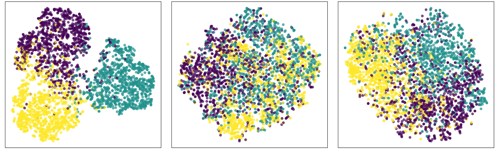
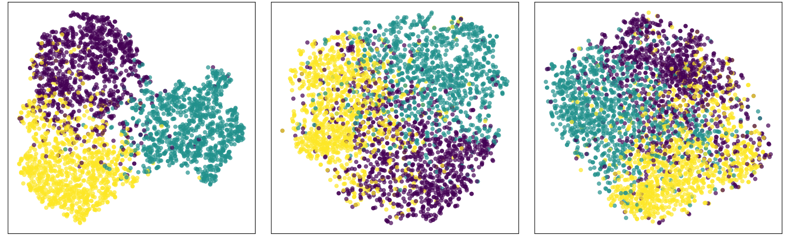
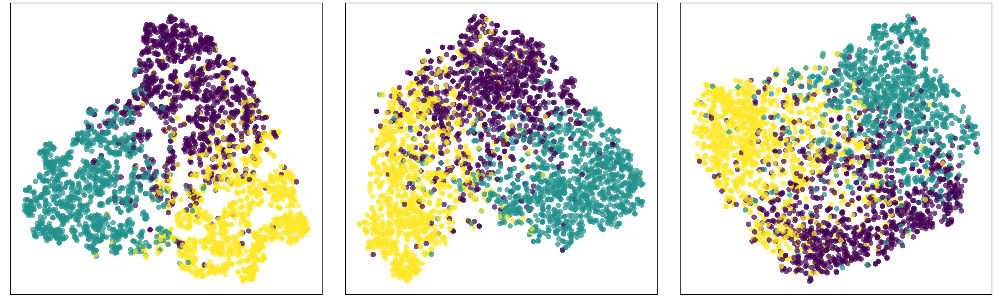
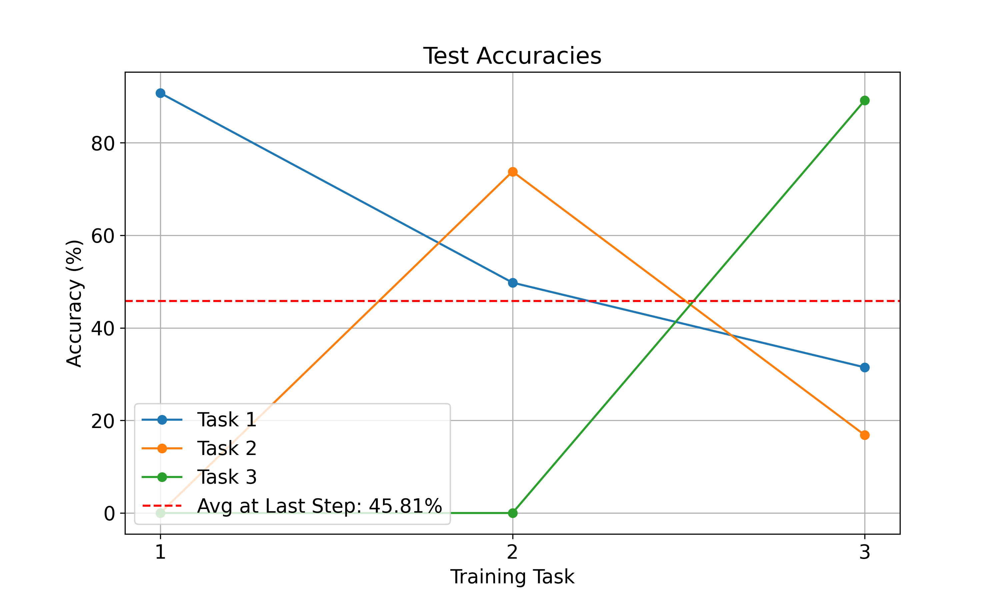
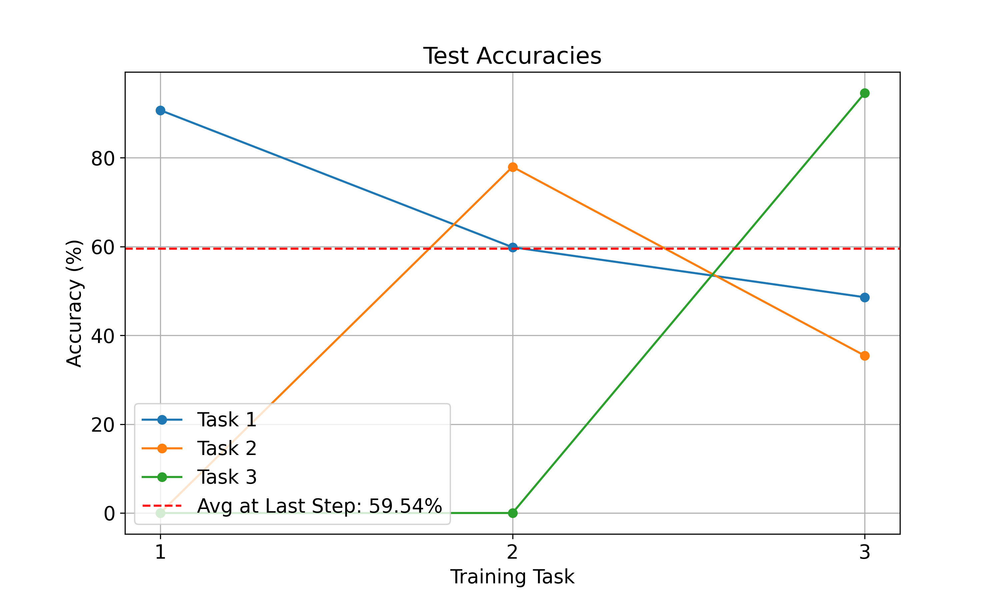
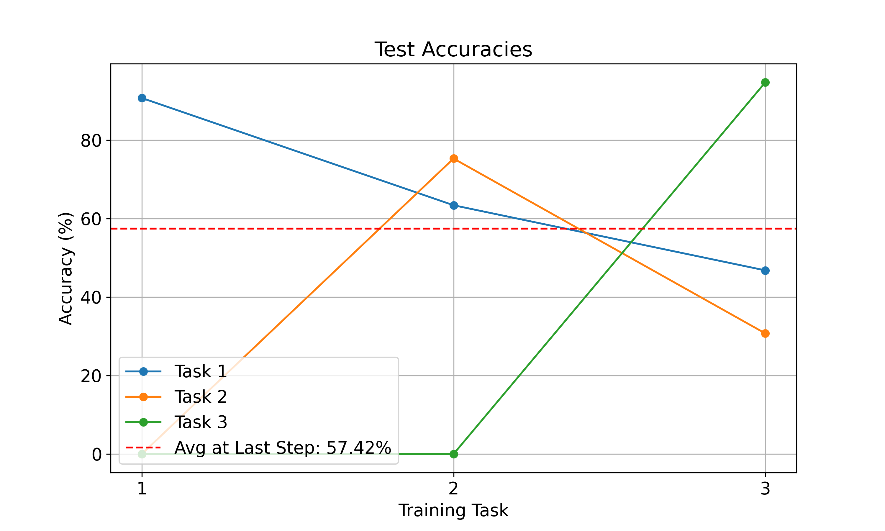

# Activation Preserving Loss

## Abstract

Catastrophic forgetting remains a key challenge in continual learning, where neural networks trained sequentially on multiple tasks lose performance on earlier ones. This work introduces an activation-based regularization method to address this issue. Leveraging Grad-CAM saliency maps, which reveal that forgetting shifts attention to irrelevant regions, and analysis of the feature space after applying dimensionality reduction techniques, which shows diffused activation clusters over time, our method preserves task-specific activations. By enforcing similarity between the activations of the current and earlier models, we prevent the degradation of critical representations. For each new task, a composite loss function combines cross-entropy with an activation-preserving loss (APR) or a saliency-preserving loss (SPL) applied to interleaved previous-task samples. Experiments show that this method reduces forgetting, improves performance retention, and preserves task-specific interpretability.

## Project Overview

In the root folder there are conceptually 4 topics:
- **Activation preserving loss** (`activation_preserving_loss.py`): Implementation of a loss function that preserves task-specific activations to reduce catastrophic forgetting.
- **Saliency preserving loss** (`saliency_preserving_loss.py`): Implementation of a loss function that preserves salient regions of learned tasks to prevent forgetting.
- **Dimensionality reduction visualization** (`layer_activations_dimreduc.py`): Visualizes feature activations of the model using dimensionality reduction methods such as t-SNE.
- **Saliency visualization** (`vgg-replay.ipynb`): Uses Grad-CAM to visualize saliency maps for replayed tasks.

Additionally you can find an `experiments` folder that covers experiments we conducted in order to gain a deeper insight into forgetting:
- **Long Short Term Weight**: A brain-inspired approach to mitigate forgetting by freezing certain weights, which unfortunately did not perform as expected.
- **Fisher Information Matrix Visualizations**: Provides insights into parameter importance.
- **EWC Implementation**: Implementation of Elastic Weight Consolidation (EWC) for preserving previously learned tasks.
- **CNN Filter Visualization**: Visualizes CNN filters from a trained ResNet18 model.

## Getting started

To install the dependencies, run:

```bash
pip install -r requirements.txt
```

## Running and Training

#### Baseline
```bash
python ./train.py --loss_type activation_preserving --num_epochs 8 --saliency_lambda 0 --num_samples_per_class 0
```
#### Saliency Preserving Loss
```bash
python ./train.py --loss_type saliency_preserving --num_epochs 8 --saliency_lambda 65 --num_samples_per_class 6 --noise_std 0.09 --saliency_threshold 0.6
```

#### Activation Preserving Loss
```bash
python ./train.py --loss_type activation_preserving --num_epochs 8 --saliency_lambda 0.2 --num_samples_per_class 5
```

The above commands train the model in deterministic way.
Options for the loss type are `activation_preserving` and `saliency_preserving`.
Number of samples per class describes the number of samples per class from previous tasks that are used for computing the novel loss, namely `activation_preserving` or `saliency_preserving`.

The `saliency_threshold` ($\tau$) and `noise_std` ($\sigma_s$) are specific to the Saliency Preserving Loss. They are used for deciding which regions are considered salient (used to initialize the mask $M$) and controlling the magnitude of the noise added to non-salient regions.


All other python scripts and notebooks can be run directly without arguments.

## Results

### Dimensionality Reduction Visualization

Feature activation of last fully connected layer of model 1 (left),  model 2 (center), and  model 3 (right) on the test set data of task 1 after applying t-SNE for dimensionality reduction to two dimensions. The colors correspond to the 3 labels of task 1. Replay buffer with varying number of random samples (30, 300, 3000) from task 1.





### Vanilla Training



### Activation Preserving Loss



### Saliency Preserving Loss


